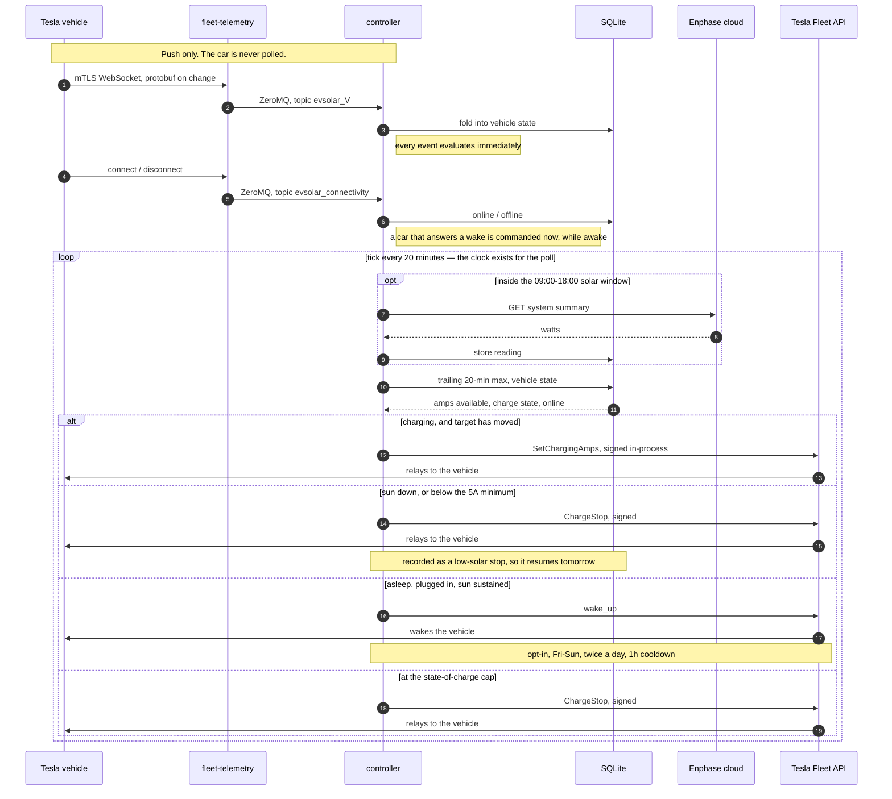
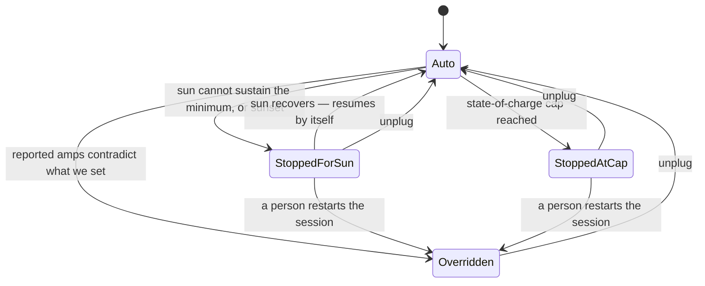

# EvSolarChargeController

Automatically matches a Tesla wall connector's charge current to rooftop solar production, and
backs off the moment someone changes amps by hand in the Tesla app.

Solar production is read from the Enphase cloud on a 20-minute cadence during daylight hours; the
target current is the **maximum** amp-equivalent seen in the trailing 20 minutes, which biases
toward overshoot rather than chasing every passing cloud. Vehicle state arrives by push — the car
is never polled, because polling can wake a sleeping vehicle.

## Status

| Piece | State |
|---|---|
| Domain logic (decision, override, solar math, window) | Implemented, 126 tests passing |
| SQLite store | Implemented and tested |
| Enphase v4 client (OAuth refresh, quota guard) | Implemented, not yet exercised against the live API |
| Tesla commands (signed, in-process) | Implemented, not yet exercised against a vehicle |
| Telemetry ingest (ZeroMQ + protobuf) | Decoder tested; socket not yet exercised against a real server |
| Terraform (VCN, subnet, security list) | **Applied.** Network exists in `us-chicago-1` |
| The VM itself | **Running.** A1.Flex, 1 OCPU / 6 GB, AD-2, aarch64 — took 71 launch attempts |
| Host prerequisites | Docker, compose, and the 8443/4443 firewall rules verified in place |
| One-time OAuth / virtual-key setup | Not started — needs a human, see [docs/SETUP.md](docs/SETUP.md) |

Nothing here has run against real hardware yet. See
[docs/ARCHITECTURE-DECISIONS.md](docs/ARCHITECTURE-DECISIONS.md) for the places where the original
design turned out not to match how these APIs and clouds actually work, and what replaced them.

## Architecture

```
Tesla vehicle
     │  mutual-TLS WebSocket, protobuf records
     ▼
Oracle Cloud Always Free VM (Ampere A1, arm64)
  ├─ fleet-telemetry (Tesla's server, terminates mTLS)
  │        │ ZeroMQ PUB
  │        ▼
  └─ evsolar ── telemetry ingest ── fold into state ──┐
                                                      │
                control loop (every 20 min, 09:00–18:00 local)
                     │                                │
                     ├── Enphase cloud (production)   │
                     │                                ▼
                     └── signed command ──────►  SQLite
                              │                  • vehicle state
                              ▼                  • solar readings (rolling 20 min)
                     Tesla Fleet API              • monthly call counter
                                                  • rotating refresh tokens
```

Two processes, one box. Commands are signed in-process using Tesla's `vehicle-command` library, so
there is no proxy container; the controller subscribes to fleet-telemetry's ZeroMQ socket directly,
so there is no bridge.

### One cycle, end to end

Telemetry arrives continuously and unprompted; the control loop runs on its own clock. They meet
only in the database.



### The control loop

Decisions happen on events; the clock exists for the Enphase poll. Every telemetry frame and every
connectivity change evaluates immediately — a car that comes online after a wake is commanded while
it is provably awake, not up to twenty minutes later when it has gone back to sleep. A tick still
evaluates too, so a quiet system reconsiders every 20 minutes.

On each evaluation, the controller:

1. On ticks inside the daylight window only: polls Enphase for current production, converts watts
   to amps at the configured service voltage, and stores the reading.
2. Takes the maximum of the readings inside the trailing 20 minutes. Readings are never deleted —
   a year of them is about a megabyte, and they are the only real measurement of this array.
3. Reads the vehicle's last-known state and decides:
   - no telemetry, or telemetry older than 6 hours → **skip** (the car is probably asleep)
   - manual override active → **skip** until the car unplugs
   - at or above the state-of-charge cap → **stop** once, then leave it alone
   - solar below the connector minimum → **stop** rather than draw the shortfall from the grid
   - solar recovered after our own low-solar stop → **resume**
   - plugged in and idle, and `StartWhenPluggedIn` is set → **start** at the solar-matched current
   - not charging for any other reason → **skip**, and critically, send nothing that could wake it
   - already at the target → **skip** the redundant command
   - otherwise → clamp into `[MinChargeAmps, MaxChargeAmps]` and set the current
4. Records what it set, so the next telemetry frame can be compared against it.

Every decision is logged with its reason.

### The session state machine

The controller's relationship to the charge session is one explicit state, not a set of flags:



`Auto` is normal control. The two stop states record *why we stopped*, which is what decides
whether the session resumes by itself: a sun stop does, a cap stop does not. `Overridden` means a
person took over, and only unplugging hands control back. Every transition is made in exactly one
place and carries a timestamp, which the settle window is measured against.

### Override detection

The ingest compares each reported charge current against the value this controller last set. A
mismatch means a human moved the slider, so automatic adjustment stops until the connector comes
out. Four details keep that from misfiring:

- **Settle window.** Mismatches within 3 minutes of our own command are ignored, because telemetry
  emitted before the command landed still carries the old value.
- **Vehicle-reported ceiling.** If the car reports a maximum below our configured one, targets are
  capped to it — otherwise every cycle would look like a mismatch.
- **Unplug, not pause.** Charging completing or stopping does *not* clear an override; only a
  disconnected state or a disengaged charge-port latch does.
- **Our own stops don't count.** A resume clears the stop marker before commanding, so the
  controller never mistakes its own resume for a person restarting the session.

## Rate limits

The Enphase free "Watt" plan allows 10 calls/minute and **1000 calls/month**. At 3 calls/hour
across a 9-hour window, a 31-day month costs 837 calls. That is a thin margin, so:

- Every call is counted in SQLite and logged with its running total.
- A configurable budget (`EVSOLAR_ENPHASE_BUDGET`, default 950) hard-stops polling before the real
  cap is hit — and stops before the request leaves the process, not after.
- Failures are **never retried within a run**. A missed cycle is harmless; a retry storm is not.
- The daylight window is enforced in code as well as in the tick schedule, and a test asserts the
  two together stay inside the budget.

Tesla's Fleet API bills per use — streaming signals at $0.0001, commands at $0.001 — against a $10
monthly discount. Pushed telemetry for two cars plus a handful of commands a day lands far inside
it, but the developer account does need billing enabled.

## Repository layout

```
cmd/evsolar/            the binary: wiring, config, signal handling
internal/
  domain/               pure decision logic — no I/O, directly testable
  store/                SQLite: vehicle state, solar readings, usage counter, tokens
  enphase/              Enlighten v4 client with the monthly quota guard
  tesla/                signed commands via teslamotors/vehicle-command
  telemetry/            ZeroMQ subscriber and protobuf decoding
  controller/           the control loop and telemetry ingest
  config/               environment parsing and validation
infra/oracle/           Terraform: VCN, subnet, security list, instance
deploy/                 Dockerfile, compose file, fleet-telemetry config
tools/                  one-time OAuth and registration scripts
site/                   GitHub Pages: the public key Tesla fetches
docs/                   setup runbook and architecture decisions
```

## Local development

```bash
# The ZeroMQ binding is cgo.
brew install zeromq pkg-config    # or: apt-get install libzmq3-dev pkg-config

go test ./...
go build ./...
```

## Deploying

The Terraform builds the network and the instance:

```bash
cd infra/oracle
terraform init
terraform apply

# Ampere A1 capacity is scarce. This cycles the availability domains until one frees up,
# and stops immediately on any error that is not a capacity error.
./launch-retry.sh
```

Then on the host:

```bash
sudo mkdir -p /opt/evsolar && cd /opt/evsolar
# copy deploy/docker-compose.yml, deploy/.env, deploy/fleet-telemetry/config.json,
# the Let's Encrypt certificate, and secrets/fleet-key.pem
docker compose up -d
```

The `Renew telemetry certificate` workflow reissues the Let's Encrypt certificate weekly over
DNS-01 and restarts only the telemetry container, so the controller keeps its state.

The one-time Tesla and Enphase account setup — key generation, virtual-key pairing, OAuth
authorization, telemetry registration — cannot be expressed as infrastructure and is documented
step by step in [docs/SETUP.md](docs/SETUP.md).

## Configuration

All settings come from the environment; see [deploy/.env.example](deploy/.env.example).

| Variable | Default | Purpose |
|---|---|---|
| `EVSOLAR_VINS` | — | Comma-separated, required |
| `EVSOLAR_SYSTEM_VOLTAGE` | 240 | Watts → amps divisor |
| `EVSOLAR_MIN_AMPS` | 5 | Connector minimum; below this we stop rather than clamp up |
| `EVSOLAR_MAX_AMPS` | 16 | Matched to array peak output |
| `EVSOLAR_MAX_SOC_PERCENT` | 80 | Cap this controller will not charge past |
| `EVSOLAR_LOOKBACK` | 20m | Trailing window for the max |
| `EVSOLAR_OVERRIDE_SETTLE` | 3m | Grace period after our own command |
| `EVSOLAR_STATE_STALE_AFTER` | 6h | Telemetry older than this means "asleep" |
| `EVSOLAR_TIMEZONE` | America/Chicago | Interprets the window hours |
| `EVSOLAR_WINDOW_START_HOUR` / `_END_HOUR` | 9 / 18 | Daylight window; end is exclusive |
| `EVSOLAR_START_WHEN_PLUGGED_IN` | false | Start an idle plugged-in car when there is sun for it |
| `EVSOLAR_WAKE_TO_CHARGE` | false | Wake a sleeping plugged-in car to use available sun |
| `EVSOLAR_WAKE_DAYS` | Fri,Sat,Sun | Days waking is permitted; empty means every day |
| `EVSOLAR_MAX_WAKES_PER_DAY` | 2 | Hard ceiling; a wake costs $0.02 |
| `EVSOLAR_WAKE_COOLDOWN` | 1h | Minimum gap between wakes |
| `EVSOLAR_WAKE_SOC_HEADROOM` | 10 | Points below the cap required to justify a wake |
| `EVSOLAR_SUSTAINED_WINDOW` | 45m | How far back the wake gate looks for reliable sun |
| `EVSOLAR_ENPHASE_BUDGET` | 950 | Hard stop below the 1000/month cap |

Credentials live in the `.env` file and, once rotated, in the SQLite database. Both Enphase and
Tesla invalidate the previous refresh token on every use, so the stored copy — not the `.env` seed
— is authoritative after the first refresh.
